# AGVMod插件

* ## 目录结构
   
  * ### Content：  

    **插件的资源文件夹，包括机器人模型，材质，纹理，蓝图等。**  
     

  * ### Source：
    **插件的代码文件夹。**  
      

* ## 插件使用方法  
  ### 1. 将BP_AGVManager放到场景中并配置相应参数  
    
   **_UMG_FirstPerson_,*StorageManager*和*SmapManager*可为空，此时将生成默认的对象实例。**

  ### 2. 在蓝图中获取BP_AGVManager并调用方法
    
  **调用此方法后，将会请求对应的Core接口以及scene接口。**  

  ### 3. 创建库位并更新库位状态  
    
  **或者(使用默认StorageManager)：**  
    

  ### 4. 库位自动校准  
  **当SmapManager请求到scene数据并且库位创建完成后，将自动进行库位校准操作**

  ### 5. 机器人状态更新  
  **当正常请求到Core数据后，会根据数据创建并更新机器人状态。效果如下图：**  
    

* ## 核心代码介绍  
  * ### 机器人相关  
      
    * #### AAGVManager  
      控制机器人的生命周期，库位自动校准并且提供机器人统一行为的对外接口(比如机器人显示隐藏，点击事件等)。

    * #### UAGVConfigInfo  
      Agv配置相关信息。只要包括Agv类型的对应表，机器人自动校准偏差以及机器人虚影效果的配置。  
      

    * #### AAGVBaseController  
      机器人基类，定义并实现机器人统一的行为(比如路径的更新，充电效果的显示以及机器人运动等)。
      可以按照机器人类型(料箱，叉车，顶升)实现子类，目前按照机器人型号实现了4个子类：  
      1.AHRController  海柔机器人(对应料箱机器人)  
      2.ASW500Controller SW500(对应顶升机器人)  
      3.ACDD14Controller CDD14(对应叉车机器人)  
      4.ADNController 地牛(对应叉车机器人)  

      其中CDD14和DN可合并为一种。  
      不同类型机器人可以重写TickAction方法实现不同的动作。

    * #### AHRController  
      料箱机器人。料箱机器人的核心部件为：Lift(升降机构)和StretchHand(伸缩臂)  
       

        

    * #### ASW500Controller  
      顶升机器人。顶升机器人的核心部件为：Jack(千斤顶)
        

    * #### ACDD14Controller和ADNController  
      叉车机器人。叉车机器人的核心部件为：Fork(货叉)
        

        
    
    * #### UMoveLightBaseComponent  
      机器人状态灯基类。  
      状态灯由两部分组成：一种反应机器人的运动状态，另一种反应机器人的工作状态。  
      运动状态有5种：静止，前进，后退，左转，右转  
      工作状态有6种：空闲，报错，急停，阻挡，工作，充电  
      有些机器人没有运动状态指示灯  
      每种机器人灯的变化需要重写对应的方法  
      以CDD14为例：  
      空闲状态： 
      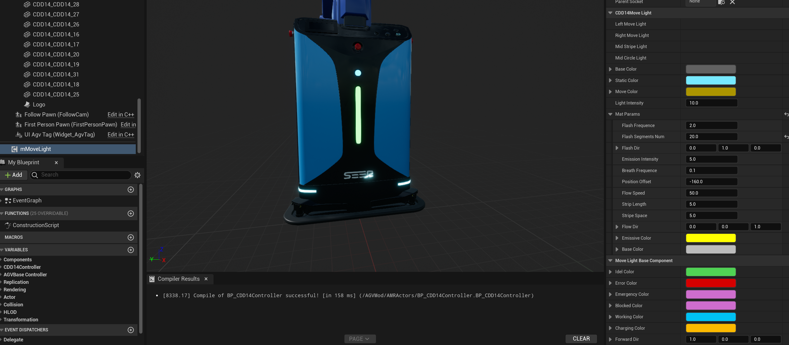  

      错误状态：  
        

      急停状态：
        

      阻挡状态：
        

      正常工作状态：
        

      充电状态：
        

      后退：
        

      左转：
        

      右转：
      

  * ### Smap相关  
      
    * #### ASmapManager  
      Smap相关的接口和数据容器(主要包括站点和路线)。

    * #### APathBaseActor  
      机器人行驶路线基类。行驶路线由四部分组成：已完成路线(暂时未用到)、当前占用路径、未完成路径和目标点。效果使用Niagara粒子系统实现，通过蓝图传入路线的点集来改变路线形状。  
        

        

    * #### USmapStyle  
      Smap元素(主要包括站点和路线)的样式配置。  
        

    * #### AStationBaseActor  
      站点基类。站点主要有4种类型LM，AP，PP和CP。当在设置中打开绘制站点选项时，会在解析完成Smap数据后，在场景中创建站点Actor。  
        

      

      注意:目前站点没有显示，要想显示站点打开站点BP，关闭HideinGame。 
        

    * #### AStationPathBaseActor  
      站点连线基类。当需要显示站点路线时，在设置中打开绘制路线选项。  
        

      要修改路线的样式可在样式配置中更换路线材质，也可使用自定义的BP。
      
      

  * ### 库位相关  
      

    * #### AStorageManager  
      库位相关的对象容器和状态管理接口。确定库位类型与库位BP的对应关系。  
      

    * #### AStorageBaseActor  
      库位基类。一个库位包含一下几个部分:  
      1.碰撞盒:用于辅助检测机器人取放货。碰撞盒的碰撞预设设置为Storage(机器人的取货部位的碰撞盒得设置为Device)，如果没有碰撞预设，可在项目设置里增加。  
        

        

      2.货物：一般是一个ChildActor组件，类型为该库位货物的BP类型。  

      3.虚拟货物:虚拟货物有两种效果，一种是机器人要来该库位取货时的效果，另一种是机器人要到该库位放货时的效果。  
      
      取货效果
        

      放货效果
        

    * #### AShelfBaseActor  
      货架基类，暂时没用。 

    * #### APileStorageBase  
      堆叠库位，目前仅针对杭纺项目。

  * ### UI相关  
      

    

    * #### UUMG_FirstPersonBase  
      第一人称相关的UI操作。
        

    * #### UUMG_AGVTag  
      机器人标签UI。现在机器人标签UI有两种显示样式：当相机距离机器人较近时展示机器人基本信息；当距离较远时，显示机器人图标。UI随距离变化的配置可在AgvManager的细节面板配置。  
        

  * ## 新增机器人  

    **新增机器人有以下几个步骤：**  
    1. 确定增加的机器人类型(这里以叉车类型机器人为例)
    2. 创建对应机器人的蓝图类，添加状态灯组件(暂时得手动添加)
    
    3. 机器人模型绑定，货物绑定，添加碰撞盒并调整至合适大小(将碰撞预设改为Device)  
      

        在构造脚本里给对应的变量赋值
    

    4. 在蓝图中实现需要的方法(取放货部位的碰撞检测，充电效果的显示隐藏等)  
     

    5. 在代码中找到ERobotType枚举并增加对应的机器人型号(如果不存在冲突可复用已有的型号，比如项目中有CDD15型号而没有CDD14型号，那么可以不新增CDD15型号直接用CDD14，只要把机器人的BP绑定为CDD15就行)，在机器人配置信息中配置该型号的对应关系
       
      
       绑定型号
    
    

    **正确绑定的情况下实际运行效果如下图：**
      

    **完整的机器人绑定过程可参考CDD14的BP**  

  * ## 库位校准  
    * ### 库位校准的时机  
      **在AgvManager的BeginPlay()开启一个定时器，会一秒检查一次是否满足库位校准的条件(成功请求scene接口并且库位创建完成)，如果满足就进行库位校准。库位校准的方法是RefreshBinsTransform()，校准完成后销毁该定时器**
      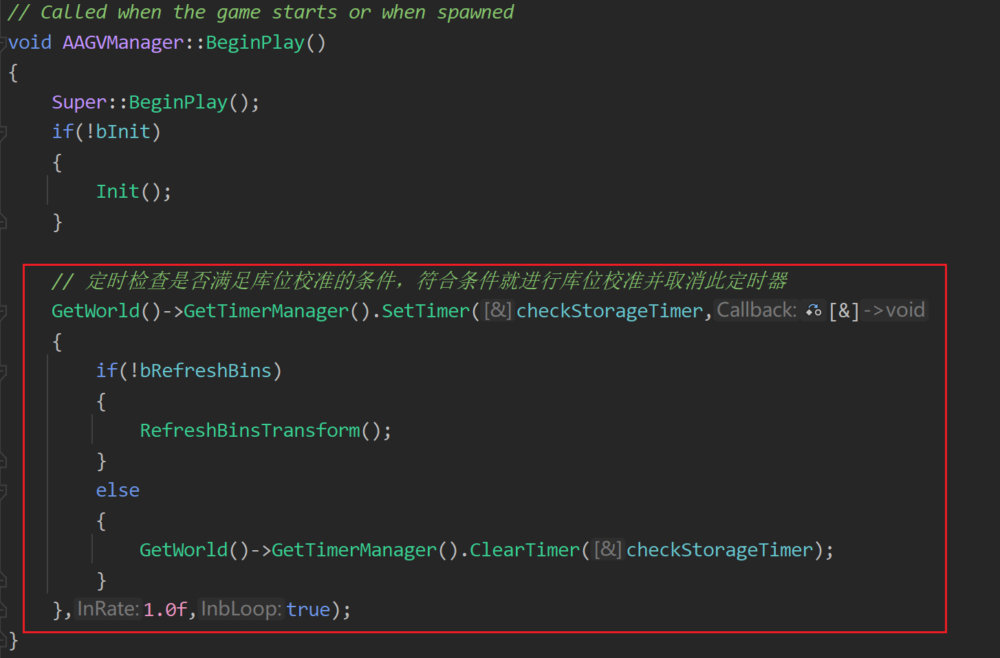  

      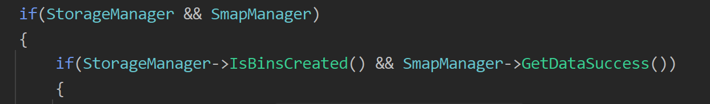  

    * ### 库位校准的原理  
      **库位校准的核心原理是：把机器人放到指定的站点，然后根据机器人正常取放货时库位与机器人的相对偏差(后面会介绍如何确定这个偏差)，计算出机器人在该站点取放货时库位的位置(其实就是相对坐标转世界坐标)。注意，这个位置不包含Z轴坐标，Z轴坐标根据库位创建的高度决定。**  
      #### 计算校准坐标的方法是  
      #### bool AAGVManager::GetAgvGoodsOffset(const ERobotType& agvType, const FStationInfo& stationInfo,FVector& outLoc,FRotator& outRot,const AActor* parentAct)  
      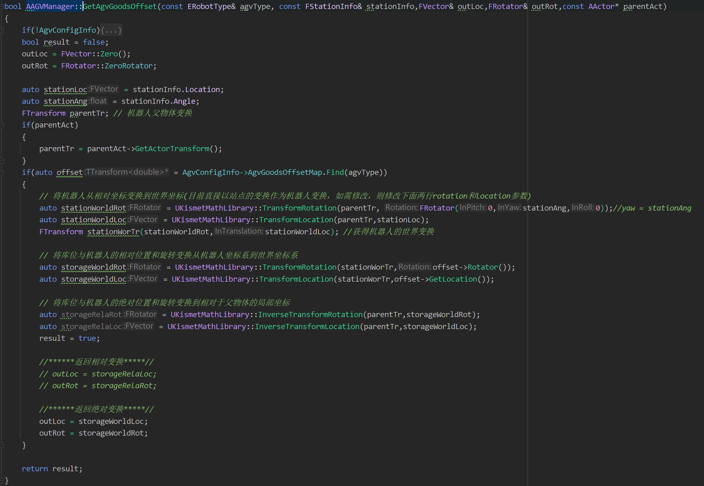
      agvType：需要校准的站点的机器人类型(即按照哪一种机器人的偏差来进行校准)。  

      stationInfo：需要校准的站点信息(即在哪里进行校准)。  

      outLoc：校准后库位的位置。  

      outRot：校准后库位的旋转。  

      parentAct：机器人的父Actor，通过机器人的父Actor可以得到机器人在该站点的世界位置。  

    * ### 确定库位与机器人的相对偏差  
      #### 以CDD14为例介绍确定偏差的方法：
      #### 1. 打开机器人BP并显示货物  
      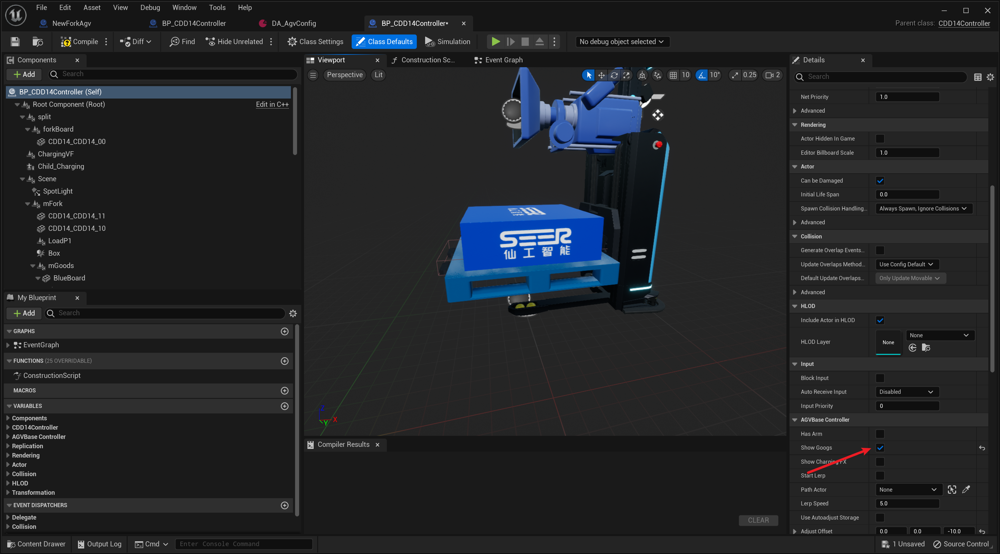  

      #### 2. 添加ChildActor组件，并将class设置为要校准的库位的BP，并且显示库位的货物  
      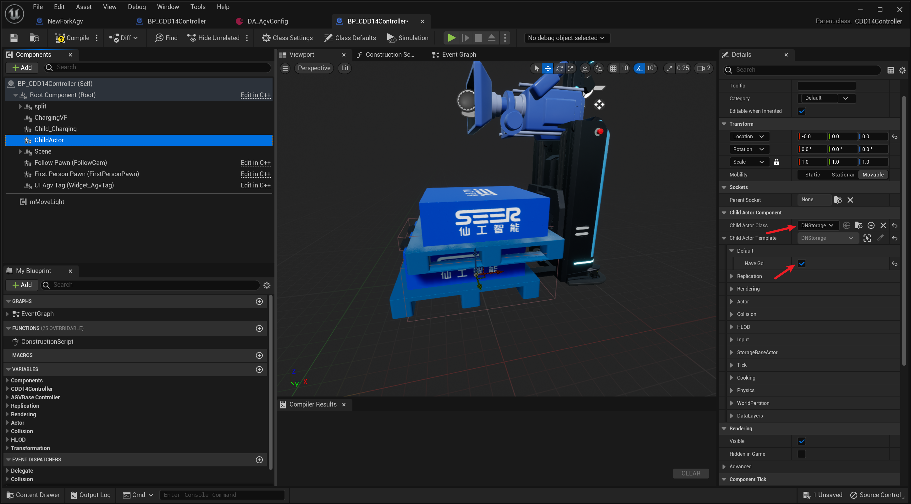  

      #### 3. 调整ChildActor组件的位置和旋转，使其和机器人身上的货物重合。记录下此时ChildActor的位置和旋转，即为库位与机器人的相对偏差。  
      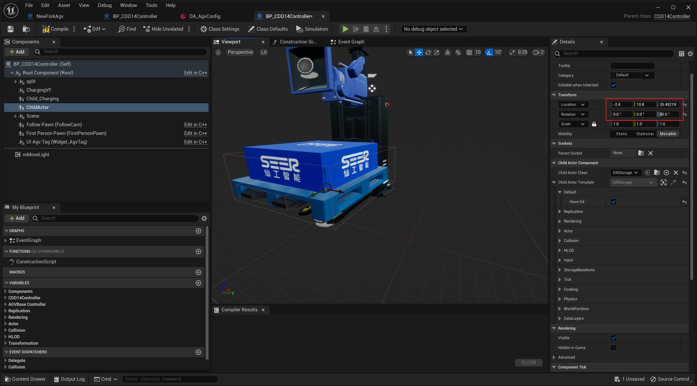  

      #### 4. 将记录的偏差保存到机器人的配置信息中。
      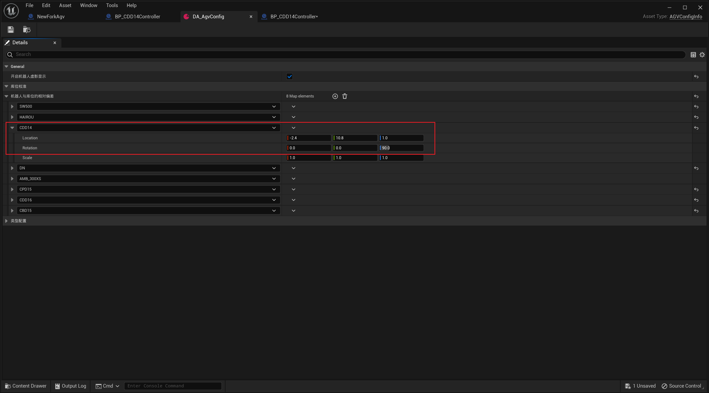  

      #### 5. 删除机器人BP中的ChildActor组件，使机器人恢复到默认状态，至此机器人偏差确定完成。  
      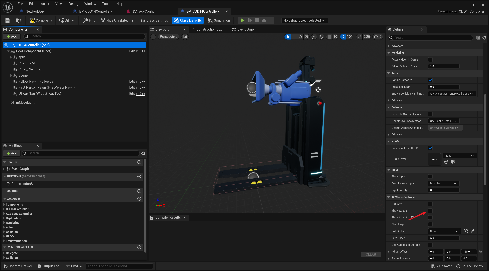
     
  * ## 机器人取(放)货一般流程  
    ### 1. 机器人动作结构(如货叉，顶升机构等)与库位发生重叠(动作结构的碰撞预设为Device，库位的碰撞预设为Storage，即库位只会检测与Device的重叠行为)。机器人得知当前操作的库位。
    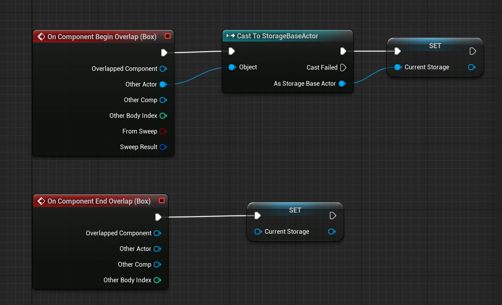

    ### 2. 根据机器人动作(比如抬升，下降，伸长等)判断机器人的行为(到底是取货还是放货)。
    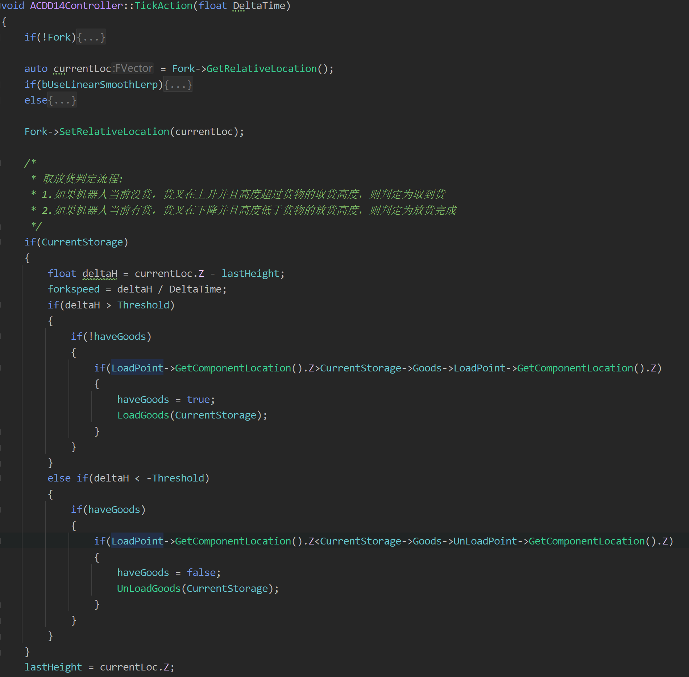  

    ### 3. 当机器人动作满足一定条件时(比如货叉高度超过或低于某个值)，判定为取(放)货完成，机器人身上货物显示(隐藏)，库位上的货物隐藏(显示)。

    ### 4. 机器人离开库位，CurrentStorage置为空。